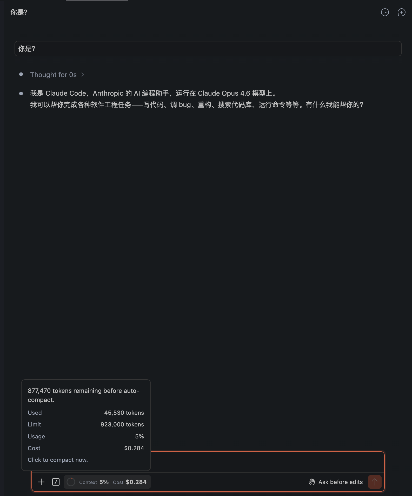

# Claude Code VSIX 学习说明

[English](./README.md)

   

## 下载对应版本

当前目录中的这份补丁说明对应 `Anthropic/claude-code` 的 `2.1.100` 版本。

原始扩展可从 Open VSX 下载：

- https://open-vsx.org/extension/Anthropic/claude-code

如果要参考本补丁进行学习或复现，请先确认你下载的基础扩展版本与 `2.1.100` 一致。

## 本次补丁摘要

当前这份本地补丁主要包含以下几项可见修改：

- 在 usage 区域增加 `Context` 统计。
- 在 usage 区域增加 `Cost` 统计。
- 修复圆圈进度条显示，使其按真实百分比变化。
- 增加 hover 弹层，用于查看更详细的 usage 信息。
- 修复此前因压缩 bundle 中辅助函数命名冲突导致的白屏问题。

## 使用辅助 Skill

这次修改过程已经整理成一个可复用的 `vsix-ui-patcher` skill，后续大家可以让大模型按照这个 skill 来辅助修改已经打包好的 VSIX UI bundle。

在当前工作区中，这个 skill 位于：

- [`../vsix-ui-patcher`](../vsix-ui-patcher)

示例提示词：

```text
Use $vsix-ui-patcher to unpack this VSIX, inspect the built webview bundle, make the requested UI change, validate it, and repack a working VSIX.
```

这个 skill 记录了本次修改中的关键经验，包括如何避免压缩 bundle 中的符号命名冲突、如何修复按百分比显示的圆圈进度条、如何保留上游 License 说明，以及如何从正确目录重新打包 VSIX。

## 声明

本文件是针对本地解包、学习和补丁修改编写的说明文档，不替代官方文档，也不修改原始授权条款。

当前目录中的解包副本与下述说明仅供学习和研究使用，请勿将其理解为官方发布版本、官方支持材料，或可公开分发的商业包。

## 原始授权说明

原始扩展的授权说明来自 [`./extension/package.json`](./extension/package.json)：

`© Anthropic PBC. All rights reserved. Use is subject to the Legal Agreements outlined here: https://code.claude.com/docs/en/legal-and-compliance.`

因此，这份本地说明遵从原始 License / Legal Agreements，仅作为学习记录使用。

## 本次修改内容

本次补丁基于解包后的 VSIX 内容，主要调整了 Claude Code 界面中的 usage 展示：

- 增加 `Context` 统计展示。
- 增加 `Cost` 统计展示。
- 修复圆圈进度条显示，使其按真实百分比绘制，而不是看起来长期接近固定半环。
- 复用已有的 usage 小组件，而不是新建独立面板。
- 增加 hover 细节展示，方便查看更完整的 usage 信息。

相关修改文件：

- [`./extension/webview/index.js`](./extension/webview/index.js)
- [`./extension/webview/index.css`](./extension/webview/index.css)

## 修改思路

由于当前拿到的是已经构建完成的 VSIX 包，而不是原始源码工程，所以本次处理采用“最小侵入”方式：

1. 先解包 VSIX，直接分析构建产物中的前端 bundle。
2. 在现有 UI 结构里找到 usage 组件的渲染位置。
3. 尽量复用已有状态数据，而不是新增通信链路或额外状态管理。
4. 只对必要的展示逻辑和样式做局部替换，尽量降低对整体功能的影响。

本次实际复用到的前端数据字段包括：

- `totalTokens`
- `totalCost`
- `contextWindow`
- `maxOutputTokens`

也就是说，这次主要是把前端已经拿到但未充分展示的数据显示出来，而不是新增后端统计能力。

## 白屏问题与修复

第一次修改后曾出现白屏问题。

原因是：在压缩后的前端 bundle 中，我新增的辅助函数命名过短，与已有的混淆变量名发生了冲突，导致运行时逻辑异常。

后续修复方式：

- 不再使用过短的辅助函数名。
- 改用足够独特的名称，避免与 bundle 内已有符号重名。
- 最终使用的函数名为 `formatUsageTokensP2QnnQ` 和 `formatUsageCostP2QnnQ`。

修复后界面已经恢复正常，并重新打包出了可用版本。

此外，这次还单独修正了 usage 圆圈的显示逻辑：

- 之前的圆圈样式在视觉上容易误导，看起来并没有严格按照真实百分比变化。
- 最终版本将其改为基于 SVG 的真实环形进度，根据实际 usage 百分比直接绘制。
- 因此像 `5%`、`23%`、`68%` 这样的数值，现在会对应明显不同的圆弧长度。

## 如何解包

`.vsix` 本质上可以按压缩包处理。

可选做法：

- 把 `.vsix` 当作 zip 解压到一个目录。
- 使用支持 zip 格式的解压工具直接打开。

本次学习使用的解包目录为：

`Anthropic.claude-code-2.1.100@darwin-arm64`

## 如何重新打包

完成修改后，需要在“解包后的根目录”内重新打包，而不是在它的父目录执行。

先进入解包目录：

```bash
cd Anthropic.claude-code-2.1.100@darwin-arm64
```

然后执行重新打包命令：

```bash
zip -qr 'Anthropic.claude-code-2.1.100@darwin-arm64-patched-fixed.vsix' .
```

说明：

- `zip -q` 表示安静模式。
- `-r` 表示递归打包当前目录全部内容。
- 最后的 `.` 很重要，表示把当前解包根目录中的内容直接打进 VSIX。

如果在错误目录执行，最终 VSIX 可能会多包一层目录，导致扩展无法正常安装或运行。

## 产物说明

当前工作区中的相关产物：

- 原始解包目录：`Anthropic.claude-code-2.1.100@darwin-arm64`
- 早期测试包，曾出现白屏问题：`Anthropic.claude-code-2.1.100@darwin-arm64-patched.vsix`
- 修复后的可用包：`Anthropic.claude-code-2.1.100@darwin-arm64-patched-fixed.vsix`

## 补充说明

本说明不替代官方 README。官方扩展说明仍以 [`./extension/README.md`](./extension/README.md) 为准。

如果后续还要继续修改 UI，建议优先：

- 先搜索现有状态字段是否已经存在。
- 尽量复用原组件或原布局位置。
- 在压缩 bundle 中避免使用过短、过普通的新增变量名。
- 每次修改后至少做一次语法检查和真实界面验证。

## 仅供学习

再次说明：这份补充文档和本地补丁仅供学习、分析、研究与个人实验使用；使用时请遵守原始版权声明以及 Anthropic 的相关 Legal Agreements。
